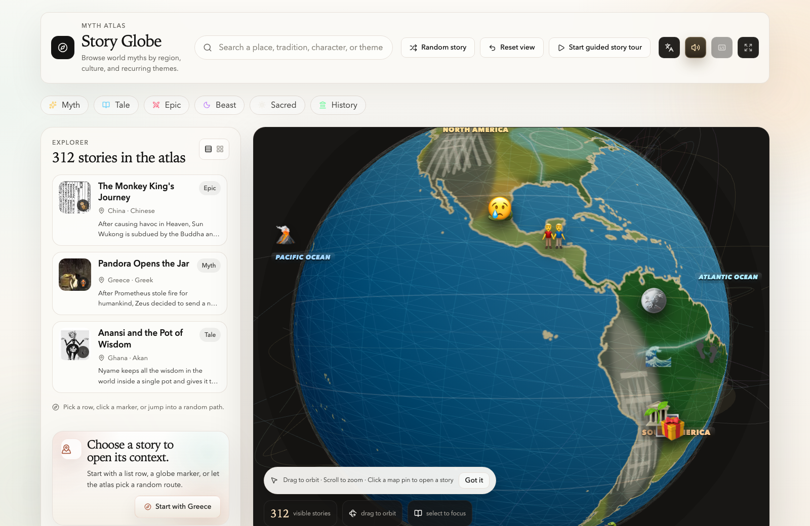
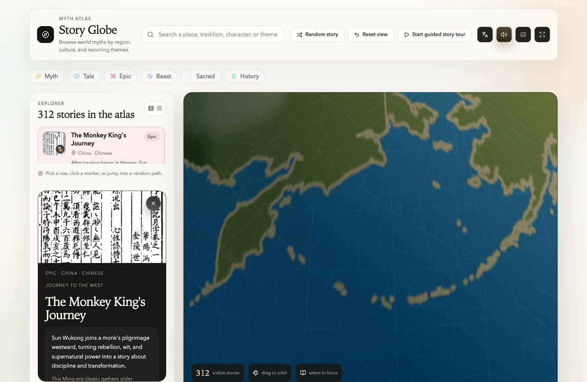
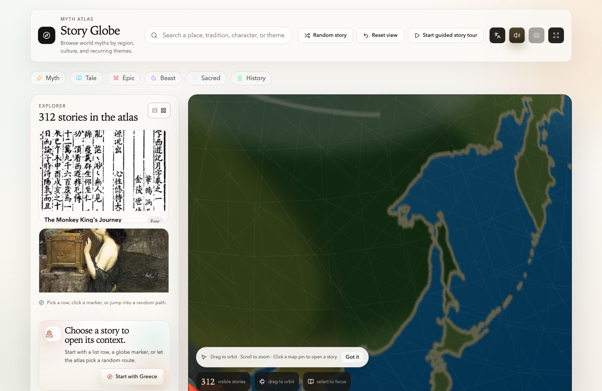
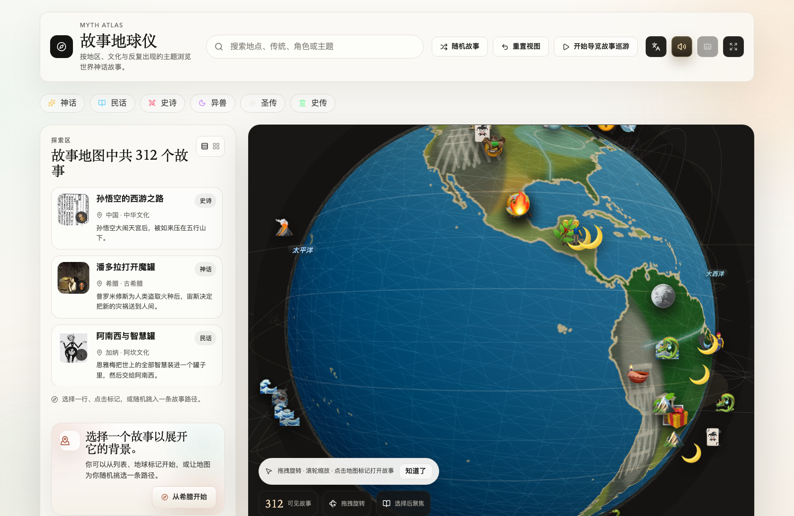

# Myth Atlas

Myth Atlas is an interactive story globe for exploring mythology and folklore by region, culture, and recurring themes.

It is still a local app, but the README below is written for people who mainly want to run and enjoy it, not just hack on the code.

Project page:

```text
https://shadowed-island.github.io/myth-atlas/
```

## What You Can Do

- Spin a 3D globe and jump into stories through map markers.
- Browse hundreds of myths, folktales, epics, sacred stories, and legendary creatures.
- Search by place, tradition, character, or theme.
- Open a story detail panel with artwork, background, themes, and related paths.
- Switch between list browsing and card browsing.
- Start a guided tour and optionally enable spoken narration.
- Switch between English and Chinese.
- Let the atlas pick a random story for you.
- Optionally package it as a desktop app with Electron.

## Real Screenshots

### Main exploration view



The default layout combines the globe, search, category filters, and story list in one screen.

### Story detail view



Selecting a story opens a richer view with artwork, location context, and a longer narrative summary.

### Card browsing view



Card view is useful when you want to browse visually before opening a story path.

### Chinese interface



The full app can switch to Chinese from the language menu in the top bar.

## Quick Start for Regular Users

If you just want to try Myth Atlas, the fastest path is to download a release build.

### Download a Release

Open the releases page in your browser:

```text
https://github.com/shadowed-island/myth-atlas/releases
```

Download the asset that matches your machine from the latest release. Current release files follow this pattern:

- macOS Apple Silicon: `myth-atlas-<version>-mac-arm64.zip`
- Windows x64 installer: `myth-atlas-<version>-win-x64.nsis.exe`
- Windows x64 portable zip: `myth-atlas-<version>-win-x64.zip`

If you prefer to download the latest release directly to a local folder with GitHub CLI:

```bash
mkdir -p ~/Downloads/myth-atlas
gh release download \
  --repo shadowed-island/myth-atlas \
  --dir ~/Downloads/myth-atlas \
  --pattern 'myth-atlas-*.zip'
```

After downloading:

1. Unzip the archive if needed.
2. Move the app to a convenient local folder such as `~/Applications` or `~/Downloads/myth-atlas`.
3. Open the app bundle or installer from there.

If you would rather run from source, use the steps below.

### Run from Source

```bash
pnpm install
pnpm dev
```

Then open:

```text
http://localhost:3000
```

If port `3000` is already occupied, Next.js may move the app to another local port such as `3001`. In that case, open the address shown in your terminal.

## Requirements

- Node.js 20 or newer
- pnpm 10.x
- Google Chrome only if you want to run the optional end-to-end test

This project uses `pnpm@10.33.0`, as declared in `package.json`.

If `pnpm` is not installed yet, enable it through Corepack:

```bash
corepack enable
corepack prepare pnpm@10.33.0 --activate
```

## First 5 Minutes Inside the App

You do not need to know React, Next.js, or Three.js to use Myth Atlas.

1. Drag the globe to rotate it.
2. Scroll to zoom in or out.
3. Click a map marker or a story row on the left to open that story.
4. Use the search box to look up a place, character, tradition, or theme.
5. Try `Random story` if you want the app to choose a path for you.
6. Switch `English` and `中文` anytime from the top bar.
7. Switch to card view if you want to browse by artwork and summaries first.
8. Start `guided story tour` if you want the atlas to move from story to story automatically.

## Install Dependencies

```bash
pnpm install
```

The repository includes an `.npmrc` that uses the `npmmirror` registry. If your network still has trouble reaching package or browser-related resources, you can run commands with a local proxy:

```bash
HTTP_PROXY=http://127.0.0.1:7890 HTTPS_PROXY=http://127.0.0.1:7890 pnpm install
```

## Run Locally

Start the development server:

```bash
pnpm dev
```

Open the app at:

```text
http://localhost:3000
```

If you want to bind the server explicitly to localhost:

```bash
pnpm dev --hostname 127.0.0.1
```

## Production Preview

Build the app:

```bash
pnpm build
```

Start the production server:

```bash
pnpm start
```

By default, it will be available at:

```text
http://localhost:3000
```

## Desktop App Workflow

If you already downloaded a release from GitHub, you can skip this section.

If you would rather build the desktop app yourself, Electron support is already included.

Build the Electron-ready renderer and main process files:

```bash
pnpm desktop:build
```

Run the Electron app against the local Next.js dev server:

```bash
pnpm desktop:dev
```

Preview the production-style Electron app from exported local assets:

```bash
pnpm desktop:preview
```

Create packaged desktop artifacts for the current platform:

```bash
pnpm desktop:dist
```

Generated desktop outputs are written to:

```text
dist/desktop/
```

If Electron packaging needs a network-friendly mirror in mainland China, the project already sets `ELECTRON_MIRROR` for `pnpm desktop:dist`. If you still need a proxy for dependency or binary downloads, run commands like:

```bash
HTTP_PROXY=http://127.0.0.1:7890 HTTPS_PROXY=http://127.0.0.1:7890 pnpm desktop:dist
```

### macOS First Launch

Current macOS desktop builds are not Apple-notarized yet, so macOS may block the app the first time you open it and show a message such as:

```text
"Myth Atlas" Not Opened
Apple could not verify "Myth Atlas" is free of malware that may harm your Mac or compromise your privacy.
```

If you trust the app bundle you built yourself or downloaded from this project, you can allow it manually:

1. In the warning dialog, click `Done`. Do not click `Move to Trash`.
2. Open `System Settings` -> `Privacy & Security`.
3. Scroll to the `Security` section.
4. Find the blocked `Myth Atlas` message and click `Open Anyway`.
5. Confirm again by clicking `Open`.

After that, macOS saves the app as an exception and you can open it normally in the future.

The `Open Anyway` button usually appears only after you have tried to open the app once, and Apple may show it for about one hour after the blocked launch attempt.

## Common Checks

Run unit tests:

```bash
pnpm test
```

Run TypeScript checks:

```bash
pnpm typecheck
```

Run linting:

```bash
pnpm lint
```

Run the end-to-end test after building the app:

```bash
pnpm build
pnpm e2e
```

The e2e script starts a local production server on a random `127.0.0.1` port unless `E2E_BASE_URL` is provided.

## Common Scripts

| Command | Description |
| --- | --- |
| `pnpm dev` | Start the Next.js development server. |
| `pnpm build` | Create a production build. |
| `pnpm start` | Start the production server. |
| `pnpm desktop:build` | Build export-compatible renderer assets and compile Electron entry points. |
| `pnpm desktop:dev` | Run Electron against the local Next.js development server. |
| `pnpm desktop:preview` | Launch Electron against exported local production assets. |
| `pnpm desktop:smoke` | Run the Electron smoke test against exported production assets. |
| `pnpm desktop:dist` | Package Electron artifacts for the current host platform into `dist/desktop/`. |
| `pnpm desktop:dist:mac:arm64` | Package release-ready macOS arm64 Electron artifacts. |
| `pnpm desktop:dist:win:x64` | Package release-ready Windows x64 Electron artifacts. |
| `pnpm test` | Run Vitest unit tests. |
| `pnpm typecheck` | Run TypeScript without emitting files. |
| `pnpm lint` | Run ESLint. |
| `pnpm e2e` | Run the Playwright-based e2e test. |
